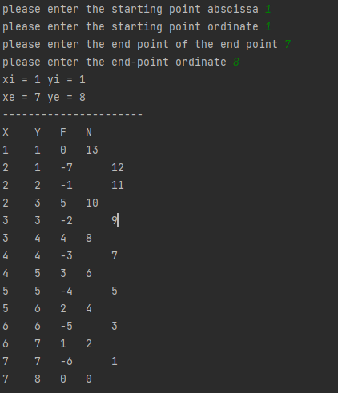
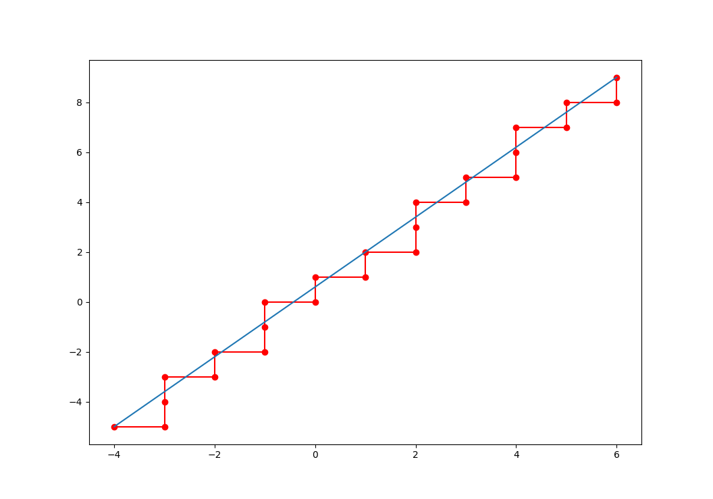

python implementation of linear interpolation algorithm
<!-- more -->
<!-- markdownlint-disable MD041 MD002-->
# [algorithm] straight_line
## Program

```python
# the first quadrant linear interpolation calculation
# all coordinates are in the first quadrant
# the basic unit is 1
# need to specify the initial point and end point

from pylab import *
# introduce pylab package

xi = int(input("please enter the starting point abscissa "))
yi = int(input("please enter the starting point ordinate "))
# enter the starting coordinate

xe = int(input("please enter the end point of the end point "))
ye = int(input("please enter the end-point ordinate "))
# enter the end coordinate

x = xi
y = yi
# initialize coordinates

x_zero = [xi, xe]
y_zero = [yi, ye]
x_label = [x]
y_label = [y]
# define image array

print("xi =", xi, "yi =", yi)
print("xe =", xe, "ye =", ye)
# output starting coordinates and end point coordinates

n = abs(xe-xi) + abs(ye-yi)
# ask for a step size


F = (xe - xi) * y + (yi - ye) * x + (xi * ye - xe * yi)
# calculate the deviation value

print("----------------------")
# pagination

print("X", '\t', "Y", '\t', "F", '\t', "N")
print(x, '\t', y, '\t', F, '\t', n)
# output the first set of data

# insert algorithm
while n > 0:
    n = n - 1
    if F >= 0:
        x = x + 1
        F = F + (yi - ye)
        print(x, '\t', y, '\t', F, '\t', n)
    else:
        y = y + 1
        F = F + (xe - xi)
        print(x, '\t', y, '\t', F, '\t', n)
    x_label.append(x)
    y_label.append(y)
    # pass xy to the coordinate array

# draw image
plt.plot(x_label, y_label, 'ro-')
plt.plot(x_zero,y_zero)
plt.show()
# end

```


## Result





## block diagram

